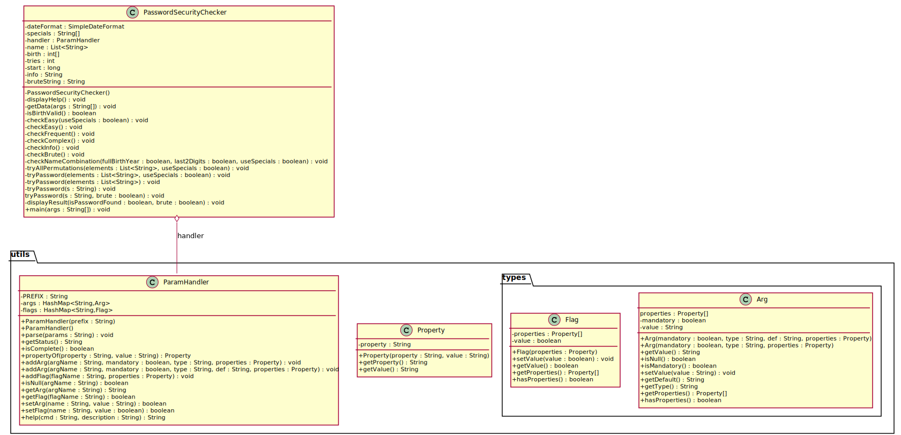

1. [Introduzione](#introduzione) 

    1. [Informazioni sul progetto](#informazioni-sul-progetto)

    1. [Abstract](#abstract)

    1. [Scopo](#scopo)

1. [Analisi](#analisi)

    1. [Analisi del dominio](#analisi-del-dominio)
  
    1. [Prerequisiti](#prerequisiti)

    1. [Analisi e specifica dei requisiti](#analisi-e-specifica-dei-requisiti)

    1. [Use case](#use-case)

    1. [Pianificazione](#pianificazione)

        - [Gantt Preventivo](#gantt-preventivo)

        - [Gantt Consuntivo](#gantt-consuntivo)
    
    1. [Analisi dei mezzi](#analisi-dei-mezzi)

1. [Progettazione](#progettazione)

    1. [Design dell’architettura del sistema](#design-dellarchitettura-del-sistema)

    1. [Activity Diagram](#activity-diagram)

    1. [Descrizione Activity Diagram](#descrizione)

    1. [Diagramma delle classi](#diagramma-delle-classi)

1. [Implementazione](#implementazione)

    1. [Gestione Parametri](#gestione-parametri)

    1. [Controllo delle password](#Controllo-delle-password)

        1. [Metodi tryPassword](#Metodi-tryPassword)

        1. [Metodo tryAllPermutations](#Metodo-tryAllPermutations)

        1. [Metodi di controllo](#Metodi-di-controllo)

1. [Test](#test)

    1. [Protocollo di test](#protocollo-di-test)

    1. [Risultati test](#risultati-test)

    1. [Mancanze/limitazioni conosciute](#mancanze/limitazioni-conosciute)

1. [Consuntivo](#consuntivo)

1. [Conclusioni](#conclusioni)

    1. [Sviluppi futuri](#sviluppi-futuri)

    1. [Considerazioni personali](#considerazioni-personali)

1. [Sitografia](#sitografia)

1. [Allegati](#allegati)


## Introduzione

#### Informazioni sul progetto

  -   Allievo e docente coinvolti nel progetto: Erik Pelloni, Luca Muggiasca (docente)

  -   SAM Trevano sezione informatica I3BB 2021/2022

  -   Data di inizio del progetto: 9 Settembre 2021

  -   Data di consegna del progetto: 23 Dicembre 2021

  -   **Background/Situazione iniziale**:
  Un utente vuole controllare la sicurezza della propria password.

  -   **Descrizione del problema e motivazione**: 
  Il programma, nel modo spiegato seguentemente permette di verificare il grado di sicurezza della password in base a dei dati personali. È importante utilizzare delle password efficaci in modo da evitare il furto di account o dati.

  -   **Approccio/Metodi**: Sulla base di alcuni dati personali eventualmente passati al programma, quest'ultimo proverà a risalire alla password.

  -   **Risultati**: Il programma stampera l'esito finale (password trovata/non trovata), il numero di tentativi eseguiti per trovare la password e il tempo impiegato.

 ### Abstract

  > *Nowadays, everyone has many different accounts for which a password is 
  > required. Choosing a secure password is very important to avoid data theft. 
  > This program checks the security of the password entered, based on optional 
  > information passed in as a parameter.*

### Scopo

  Lo scopo del progetto è quello di creare un programma che sia in grado di dare un feedback riguardante la sicurezza di una password.

## Analisi

### Analisi del dominio

  Questo capitolo descrive il contesto in cui il prodotto verrà
  utilizzato:

  -   Il prodotto verrà utilizzato per controllare la sicurezza della propria password.

### Prerequisiti
  -   Il prodotto può essere utilizzato da chiunque

  -   La competenza richiesta per l'utilizzo di questo programma è saper lanciare un programma tramite linea di comando. Non sono richieste altre conoscenze o competenze.
  - È necessario avere Java installato sul dispositivo che si vuole utilizzare per eseguire il programma.

### Analisi e specifica dei requisiti

  Seguono una descrizione dell'analisi e la specifica dei requisiti.

  -   La funzione del prodotto è quella di controllare la sicurezza di una password, cercando di trovarla utilizzando dei dati relativi alla persona.

  -   Il prodotto è eseguibile tramite linea di comando e stampa i risultati a terminale.

  -  I dati verranno utilizzati unicamente per il funzionamento del programma e vengono eliminati una volta completata l'operazione.

  In base alla lista dei requisiti e all’analisi degli stessi, è stata redatta una *specifica dei requisiti* nella quale sono elencate e
  descritte in modo dettagliato le funzionalità che il prodotto
  fornisce. I requisiti non rappresentano delle attività bensì delle caratteristiche che il prodotto possiede.


  | **ID** | **Titolo**                   | **Descrizione**                                                                                                           | **Priorità** | **Vers** | **Note**                        |
  | ------ | ---------------------------- | ------------------------------------------------------------------------------------------------------------------------- | ------------ | -------- | ------------------------------- |
  | Req-01 | Linea di comando             | Il programma sarà eseguibile tramite linea di comando                                                                     | 1            | 1.0      |                                 |
  | Req-02 | Dati input                   | Al programma verranno passati i seguenti dati:<br>  nome e cognome, data di nascita e un terzo dato a propria scelta      | 1            | 1.1      | I dati sono facoltativi         |
  | Req-03 | Controllo validità           | Verrà eseguito un controllo della validità dei dati inseriti                                                              | 1            | 1.0      |                                 |
  | Req-04 | Help                         | Sarà possibile visualizzare un help che mostra il funzionamento del programma                                             | 1            | 1.0      |                                 |
  | Req-05 | Controllo semplice           | Verranno controllate delle password combinate in modo semplice                                                            | 1            | 1.0      |                                 |
  | Req-06 | Controllo complesso          | Verranno controllate delle password combinate in modo più complesso                                                       | 1            | 1.0      |                                 |
  | Req-07 | Controllo password frequenti | Verrà controllata una lista contenente delle password frequenti                                                           | 1            | 1.0      |                                 |
  | Req-08 | Brute force                  | Se la password non viene trovata con i controlli precedenti si prosegue con un attacco brute force, se l'utente lo decide | 2            | 1.0      |                                 |
  | Req-09 | Stampa valori                | Vengono stampati i tentativi effettuati e il tempo impiegato                                                              | 1            | 1.0      |                                 |
  | Req-10 | Script                       | Sarà possibile passare i dati a uno script tramite file csv, lo script invocherà automaticamente il programma             | 3            | 1.2      | Sostituito dal requisito Req-11 |
  | Req-11 | Gestione parametri           | Il passaggio di parametri viene gestito all'interno del programma, utilizzando una libreria.                              | 2            | 2.0      |                                 |
  
  


**Legenda elementi tabella dei requisiti:**

**ID**: identificativo univoco del requisito

**Titolo**: titolo dato al requisito

**Nome**: descrizione del requisito

**Priorità**: indica l’importanza di un requisito nell’insieme del
progetto, definita assieme al committente. Sono defininiti al massimo di 3 livelli di priorità in questo modo:
+ 1: priorità maggiore
+ 3: priorità minore

**Versione**: indica la versione del requisito. Ogni modifica del
requisito avrà una versione aggiornata.

Sulla documentazione apparirà solamente l’ultima versione.

**Note**: eventuali osservazioni importanti o riferimenti ad altri
requisiti.

**Sotto requisiti**: elementi che compongono il requisito.


### Use case


L'utente è in grado (tramite linea di comando) di verificare la sicurezza della propria password, anche in relazione con i propri dati personali.

### Pianificazione

#### Gantt preventivo


#### Gantt consuntivo

### Analisi dei mezzi
Per la creazione del progetto è stato utilizzato un PC con Windows 10, Java 16 e
Visual Studio Code, non ci sono altri requisiti a livello hardware per la 
creazione e lo svolgimento di questo progetto.

Nel mio caso specifico le specifiche del computer sul quale ho lavorato sono le seguenti:
- Nome SO	Microsoft Windows 10 Enterprise
- Processore	Intel(R) Core(TM) i5-7360U CPU @ 2.30GHz, 2301 Mhz, 2 core, 4  processori logici
- Memoria fisica installata (RAM)	16.0 GB


È stata utilizzata una libreria scritta da Paolo Bettelini, che permette una
migliore gestione dei parametri passati come argomenti da linea di comando.

Il prodotto potrà essere eseguito su un qualsiasi dispositivo che abbia Java
installato, indipendentemente dal sistema operativo.

## Progettazione

Questo capitolo descrive esaustivamente come deve essere realizzato il
prodotto fin nei suoi dettagli. (Una buona progettazione permette
all’esecutore di evitare fraintendimenti e imprecisioni
nell’implementazione del prodotto.)

### Design dell’architettura del sistema

-   Si tratta di un programma che viene invocato tramite linea di comando e con il passaggio di argomenti.

-   Composto da 1 classe scritta in java.

### Activity Diagram


#### Descrizione

Lanciando l'applicazione si passano i dati necessari per il funzionmento.
<br>Se le informazioni non sono passate nel modo corretto o se l'utente ha scento di visualizzare l'help, l'applicazione mostra l'help (che spiega la formattazine dei valori di input).
 
Una volta inseriti correttamente i dati il programma comincia a provare a forzare la password.

+ In un primo momento vengono provate le combinazioni più semplici. Se la 
password viene trovata, il programma giunge a termine, se no si passa al controllo successivo.

+ Il secondo controllo che viene effettuato è quello tra la password fornita e una lista di password frequentemente utilizzate. Anche in questo caso la procedura di funzionamento del programma è la medesima: se la password viene trovata, il programma giunge a termine, se no si passa al controllo successivo.

+ Se la password non è presente nemmeno all'interno della lista, il controllo da compiere è quello delle combinazioni più complesse. Nuovamente la procedura finale è la stessa.

+ Infine, se l'utente ha deciso di effettuarla, l'ultima ricerca effettuata è quella brute force. Una volta trovata la password o raggiunto l'eventuale limite (di tempo o di tentativi, stabilito dll'utente) il programma giunge al termine e stampa l'output finale.

+ *N.B. I controlli verranno effettuati solamente sui dati passati come parametro all'esecuzione del programma.*
<br> <br>


### Diagramma delle classi


[Immagine originale diagramma delle classi](../PasswordSecurityChecker_Classe.svg)

## Implementazione
<!--
In questo capitolo dovrà essere mostrato come è stato realizzato il
lavoro. Questa parte può differenziarsi dalla progettazione in quanto il
risultato ottenuto non per forza può essere come era stato progettato.

Sulla base di queste informazioni il lavoro svolto dovrà essere
riproducibile.

In questa parte è richiesto l’inserimento di codice sorgente/print
screen di maschere solamente per quei passaggi particolarmente
significativi e/o critici.

Inoltre dovranno essere descritte eventuali varianti di soluzione o
scelte di prodotti con motivazione delle scelte.

Non deve apparire nessuna forma di guida d’uso di librerie o di
componenti utilizzati. Eventualmente questa va allegata.

Per eventuali dettagli si possono inserire riferimenti ai diari.
-->
### Gestione parametri
Per la gestione dei parametri ho utilizzato la libreria [ParamHandler](https://github.com/paolobettelini/utils/tree/main/paramhandler) 
di Paolo Bettelini e l'ho implementata in questo modo

```java 
public class PasswordSecurityChecker {
  ...
  ParamHandler handler;
  ...
  handler.addFlag(
                "b",
                ParamHandler.propertyOf("Name", "Brute Force"),
                ParamHandler.propertyOf("Description", "Performs the brute force attack"));

  handler.addArg(
                "name", false, "String",
                ParamHandler.propertyOf("Name", "Name"),
                ParamHandler.propertyOf("Description", "Name and Surname"),
                ParamHandler.propertyOf("Format", "Name Surname"),
                ParamHandler.propertyOf("Example", "John Doe"));
  ...
  handler.parseArg();
  ...
  handler.getArg("name");
}
```

la sintassi per l'aggiunta di un parametro a un handler è la seguente

```java
handler.addArg("argName", mandatory, "type", properties);
```
il primo parametro da passare è il nome dell'argomento da aggiungere ad handler.
Il secondo è un boolean che definisce se l'argomento è obbligatorio o meno, il terzo specifica
il tipo di dato che si aspetta il parametro (per mostrarlo nell'help) e infine vanno aggiunte le varie
proprietà (composte da nome e descrizione).<br><br>

Per controllare la validità della data di nascita ho utilizzato un oggetto SimpleDateFormat del package java.text
e gli oggetti Calendar e Date del package java.util come mostrato qui sotto

```java
...
SimpleDateFormat dateFormat = new SimpleDateFormat("dd.MM.yyyy");
...
Date birthDate = dateFormat.parse(handler.getArg("birth"));
Calendar c = Calendar.getInstance();
c.setTime(birthDate);
```
Con il comando parse provo ad inserire i dati dell'utente all'interno della variabile 
`birthDate`. Nel caso in cui quest'ultimi non fossero validi, verrà sollevata un'eccezione
di tipo `ParseException`, quindi verranno richiesti nuovamente i dati.


L'accesso ai dati può essere effettuato utilizzando come nel seguente esempio 

```java
c.get(Calendar.DAY_OF_MONTH);
c.get(Calendar.YEAR);
```
All'interno del programma non ho tenuto valide le date di nascita con l'anno inferiore a 1000.


### Controllo delle password

#### Metodi tryPassword

Per eseguire il controllo vero e proprio di una password ho creato diverse "versioni" del
metodo `tryPassword`: ognuna delle quali accetta dei parametri diversi dall'altra.
Il metodo utilizzato da tutti gli altri è quello mostrato qui sotto
```java
    void tryPassword(String s, boolean brute){
        tries++;
        if (s.equals(password)) {
            // trovata, fermo il tempo di ricerca
            end = System.currentTimeMillis();
            // metodo finale
            displayResult(true, brute);
        }
    }
``` 

Questo metodo confronta la password con la stringa passata come parametro e se queste corrispondono,
allora invoca il metodo `displayResult()` per stampare il risultato e terminare il programma.
Il parametro `brute` specifica se il tentativo è stato effettuato tramite l'attacco brute force.

Altre versioni dello stesso metodo sono ad esempio quelle riportate seguentemente

```java
    private void tryPassword(String s) {
        tryPassword(s, false);
    }
```

Questo si tratta di un metodo che richiama il suo omonimo (il quale possiede però dei parametri differenti) 
con il secondo parametro fisso su `false`, in modo da poter definire un valore di "default" e dare quindi la
possibilità di invocare il metodo senza dover specificare il secondo parametro.

È presente anche un metodo `tryPassword` che accetta come parametro una lista di stringhe.
Quest'ultimo invocherà il metodo `tryPassword(String s)` su tutti gli elementi della lista e se richiesto aggiunge
anche dei caratteri speciali alla password da testare.

#### Metodo tryAllPermutations
Il metodo `tryAllPermutations`, data una lista di stringhe prova le password composte dalla combinazione degli elementi
all'interno della stessa.

Per funzionare, come prima cosa eseguo una copia della lista, per poterla manipolare senza cambiare poi l'ordine della
lista che viene passata come parametro. In seguito viene eseguito un ciclo che in base a un criterio scambia tra di loro
gli elementi della lista, creando così sempre combinazioni differenti.

All'interno di questo metodo invoco `tryPassword` in modo da controllare subito se la nuova combinazione dei dati corrisponde
alla password.

#### Metodi di controllo

Nel metodo `checkEasy` controllo password semplici come semplicemente il nome, il cognome, l'anno di nascita
e semplici combinazioni tra queste informazioni. Questi dati però sono opzionali, quindi questi controlli
potrebbero essere saltati.

Il secondo metodo ad effettuare una ricerca è il metodo `checkFrequent`. Questo controlla se la password si trova all'interno di una 
[lista di password utilizzate di frequente](https://github.com/danielmiessler/SecLists/blob/master/Passwords/Common-Credentials/)
con qualche mia aggiunta al milione di password già presenti.
Le password sono salvate in un file, il metodo le legge, le inserisce all'interno di
una lista e le prova una ad una utilizzando il metodo tryPassword, mostrato in precedenza.

## Test

### Protocollo di test

Definire in modo accurato tutti i test che devono essere realizzati per
garantire l’adempimento delle richieste formulate nei requisiti. I test
fungono da garanzia di qualità del prodotto. Ogni test deve essere
ripetibile alle stesse condizioni.


| Test Case            | TC-01                                                                                                          |
| -------------------- | -------------------------------------------------------------------------------------------------------------- |
| **Nome**             | Funzionamento da terminale                                                                                     |
| **Riferimento**      | REQ-01                                                                                                         |
| **Descrizione**      | Il programma funziona tramite linea di comando                                                                 |
| **Prerequisiti**     | Java installato sul computer, essere in possesso del programma jar e un terminale da cui eseguire il programma |
| **Procedura**        | Aprire il terminale e digitare il comando scritto nella guida per eseguire il programma                        |
| **Risultati attesi** | Il programma si avvia                                                                                          |
<br>

| Test Case            | TC-02                                                                                                                |
| -------------------- | -------------------------------------------------------------------------------------------------------------------- |
| **Nome**             | Dati obbligatori                                                                                                     |
| **Riferimento**      | REQ-03                                                                                                               |
| **Descrizione**      | I dati obbligatori sono richiesti                                                                                    |
| **Prerequisiti**     | Vedi prerequisiti TC-01                                                                                              |
| **Procedura**        | Avviare il programma senza aggiungere l'argomento -password                                                          |
| **Risultati attesi** | L'errore viene gestito, il programma mostra il messaggio di help e termina.                                          |
<br>

| Test Case            | TC-03                                                                                                                |
| -------------------- | -------------------------------------------------------------------------------------------------------------------- |
| **Nome**             | Controllo dati                                                                                                       |
| **Riferimento**      | REQ-03                                                                                                               |
| **Descrizione**      | I dati inseriti verranno controllati                                                                                 |
| **Prerequisiti**     | Vedi prerequisiti TC-01                                                                                              |
| **Procedura**        | Avviare il programma passando dei dati sbagliati, ad esempio la data di nascita con valore "02.06.10" oppure "prova" |
| **Risultati attesi** | L'errore viene gestito, il programma mostra il messaggio di help e termina.                                          |
<br>

| Test Case            | TC-xx                                                                                                                |
| -------------------- | -------------------------------------------------------------------------------------------------------------------- |
| **Nome**             | Combinazione con caratteri maiuscoli                                                                                 |
| **Riferimento**      | REQ-05 / REQ-06                                                                                                      |
| **Descrizione**      | Viene trovata una password con una combinazione particolare di caratteri in minuscolo e maiuscolo                    |
| **Prerequisiti**     | Vedi prerequisiti TC-01                                                                                              |
| **Procedura**        | Avviare il programma passando i dati e una password con una combinazione di maiuscole e minuscole, ad esempio "jOhNDoE" avendo passato il dato "John Doe" come nome |
| **Risultati attesi** | La password viene trovata senza l'utilizzo dell'attacco brute force                                                  |


### Risultati test

<!--Tabella riassuntiva in cui si inseriscono i test riusciti e non del
prodotto finale. Se un test non riesce e viene corretto l’errore, questo
dovrà risultare nel documento finale come riuscito (la procedura della
correzione apparirà nel diario), altrimenti dovrà essere descritto
l’errore con eventuali ipotesi di correzione.-->

| Test passati  | Test falliti        |
| ------------- | ------------------- |
| TC-01         |                     |
| TC-02         |                     |
|               | TC-xx               |

### Mancanze/limitazioni conosciute

<!--Descrizione con motivazione di eventuali elementi mancanti o non
completamente implementati, al di fuori dei test case. Non devono essere
riportati gli errori e i problemi riscontrati e poi risolti durante il
progetto.-->
Mi sono accorto troppo tardi, verso la fine del progetto, di aver non aver lavorato
nel modo migliore, in quanto non ho dato abbastanza importanza alla
fase di progettazione e ho fatto troppe cose "sul momento". Un motivo sicuramente è
la mia poca esperienza, visto che questo si tratta del mio primo progetto con una
durata simile. Questo errore mi ha fatto capire quanto sia importante una progettazione
completa e precisa, **prima** di iniziare a scrivere il codice.

Sempre per lo stesso motivo, il mio codice in alcuni punti è molto "hard coded" e 
a volte parecchio ripetitivo. Con la dovuta progettazione non sarebbe successo.

## Consuntivo

Consuntivo del tempo di lavoro effettivo e considerazioni riguardo le
differenze rispetto alla pianificazione (cap 1.7) (ad esempio Gannt
consuntivo).

## Conclusioni

Quali sono le implicazioni della mia soluzione? Che impatto avrà?
Cambierà il mondo? È un successo importante? È solo un’aggiunta
marginale o è semplicemente servita per scoprire che questo percorso è
stato una perdita di tempo? I risultati ottenuti sono generali,
facilmente generalizzabili o sono specifici di un caso particolare? ecc

### Sviluppi futuri
  + Aggiunta input password non in chiaro in modo interattivo
  
  + Aggiunta di un'interfaccia grafica

### Considerazioni personali
  Cosa ho imparato in questo progetto? ecc

### Sitografia

- https://www.baeldung.com/java-array-permutations, *Permutations of an Array in Java*, 28.10.2021

- https://stackoverflow.com/questions/50215907/python-brute-force-password-guesser, 02.12.2021

- https://github.com/LuMug/Mod306, *Modulo 306*, in diverse date


## Allegati

-   [Diari di lavoro](../../Diari/)

-   [Codici sorgente](../../src)

-   [Manuale d'uso](..\PasswordSecurityChecker_Guida.pdf)

-   [Qdc](..\QdC_EP_PasswordSecurityChecker.docx)
