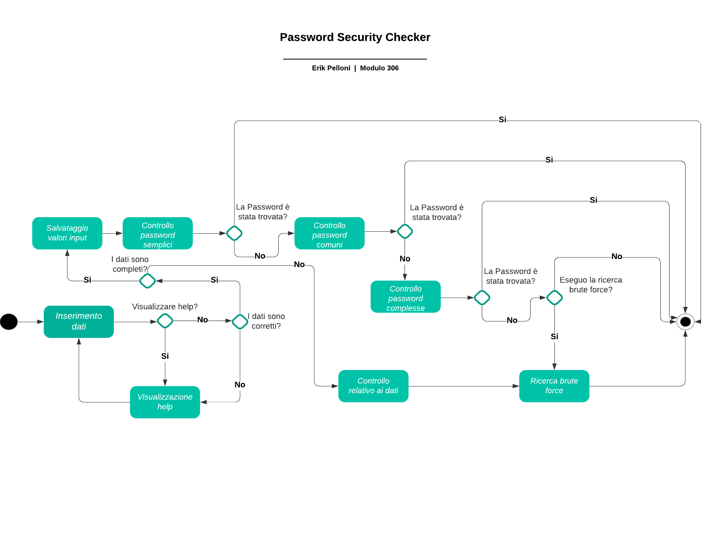

1. [Introduzione](#introduzione) 

  - [Informazioni sul progetto](#informazioni-sul-progetto)

  - [Abstract](#abstract)

  - [Scopo](#scopo)

2. [Analisi](#analisi)

  - [Analisi del dominio](#analisi-del-dominio)
  
  - [Analisi dei mezzi](#analisi-dei-mezzi)

  - [Analisi e specifica dei requisiti](#analisi-e-specifica-dei-requisiti)

  - [Use case](#use-case)

  - [Pianificazione](#pianificazione)

1. [Progettazione](#progettazione)

  - [Design dell’architettura del sistema](#design-dell’architettura-del-sistema)

  - [Design procedurale](#design-procedurale)

3. [Implementazione](#implementazione)

4. [Test](#test)

  - [Protocollo di test](#protocollo-di-test)

  - [Risultati test](#risultati-test)

  - [Mancanze/limitazioni conosciute](#mancanze/limitazioni-conosciute)

5. [Consuntivo](#consuntivo)

6. [Conclusioni](#conclusioni)

  - [Sviluppi futuri](#sviluppi-futuri)

  - [Considerazioni personali](#considerazioni-personali)

7. [Sitografia](#sitografia)

8. [Allegati](#allegati)

## Introduzione

#### Informazioni sul progetto

  -   Allievo e docente coinvolti nel progetto: Erik Pelloni, Luca Muggiasca (docente)

  -   SAM Trevano sezione informatica I3BB 2021/2022

  -   Data di inizio del progetto: 9 Settembre 2021

  -   Data di consegna del progetto: 23 Dicembre 2021

### Abstract

  E’ una breve e accurata rappresentazione dei contenuti di un documento,
  senza notazioni critiche o valutazioni. Lo scopo di un abstract efficace
  dovrebbe essere quello di far conoscere all’utente il contenuto di base
  di un documento e metterlo nella condizione di decidere se risponde ai
  suoi interessi e se è opportuno il ricorso al documento originale.

  Può contenere alcuni o tutti gli elementi seguenti:

  -   **Background/Situazione iniziale**

  -   **Descrizione del problema e motivazione**: Che problema ho cercato
      di risolvere? Questa sezione dovrebbe includere l'importanza del
      vostro lavoro, la difficoltà dell'area e l'effetto che potrebbe
      avere se portato a termine con successo.

  -   **Approccio/Metodi**: Come ho ottenuto dei progressi? Come ho
      risolto il problema (tecniche…)? Quale è stata l’entità del mio
      lavoro? Che fattori importanti controllo, ignoro o misuro?

  -   **Risultati**: Quale è la risposta? Quali sono i risultati? Quanto è
      più veloce, più sicuro, più economico o in qualche altro aspetto
      migliore di altri prodotti/soluzioni?

  Esempio di abstract:

  > *As the size and complexity of today’s most modern computer chips
  > increase, new techniques must be developed to effectively design and
  > create Very Large Scale Integration chips quickly. For this project, a
  > new type of hardware compiler is created. This hardware compiler will
  > read a C++ program, and physically design a suitable microprocessor
  > intended for running that specific program. With this new and powerful
  > compiler, it is possible to design anything from a small adder, to a
  > microprocessor with millions of transistors. Designing new computer
  > chips, such as the Pentium 4, can require dozens of engineers and
  > months of time. With the help of this compiler, a single person could
  > design such a large-scale microprocessor in just weeks.*

### Scopo

  Lo scopo del progetto (scopi didattici/scopi operativi). Dovrebbe
  descrivere il mandato, ma non vanno ricopiate le informazioni del
  quaderno dei compiti (che va invece allegato).

## Analisi

### Analisi del dominio

  Questo capitolo dovrebbe descrivere il contesto in cui il prodotto verrà
  utilizzato, da questa analisi dovrebbero scaturire le risposte a quesiti
  quali ad esempio:

  -   Background/Situazione iniziale

  -   Quale è e come è organizzato il contesto in cui il prodotto dovrà
      funzionare?

  -   Come viene risolto attualmente il problema? Esiste già un prodotto
      simile?

  -   Chi sono gli utenti? Che bisogni hanno? Come e dove lavorano?

  -   Che competenze/conoscenze/cultura posseggono gli utenti in relazione
      con il problema?

  -   Esistono convenzioni/standard applicati nel dominio?

  -   Che conoscenze teoriche bisogna avere/acquisire per poter operare
      efficacemente nel dominio?

  -   …

### Analisi e specifica dei requisiti

  Il progettista, dopo aver ricevuto il mandato, in collaborazione con il
  committente redige una lista di requisiti. Durante questi incontri,
  tramite interviste (da inserire nei diari), il progettista deve cercare
  di rispondere alle seguenti domande:

  -   Quali sono i bisogni del committente?

  -   Quali funzioni deve svolgere il prodotto?

  -   Come devono essere implementate?

  -   L’utente, come vorrebbe/dovrebbe interagire con il prodotto?

  -   Come verrà utilizzato il prodotto?

  -   Che tipo di interfaccia si immagina?

  -   Che prestazioni minime deve fornire il prodotto?

  -   Che grado di sicurezza deve avere il prodotto?

  -   …

  In base alla lista dei requisiti e all’analisi degli stessi, il
  progettista redige una *specifica dei requisiti* in cui elenca e
  descrive in modo dettagliato quali sono le funzionalità che il prodotto
  fornirà. La specifica dovrebbe essere abbastanza dettagliata da poter
  essere utilizzata come base per lo sviluppo, ma non troppo; ad esempio
  non dovrebbe contenere dettagli di implementazione, o definizioni
  dettagliate dell’interfaccia grafica a meno che questi non siano
  considerati cruciali. Non si deve scordare che i requisiti non
  rappresentano delle attività bensì delle caratteristiche che il prodotto
  dovrà possedere.

  |**ID**	|**Titolo**|**Descrizione**			|**Priorità**|**Vers**|**Note**  |
  |-------|----------|-------------|------------|--------|----------|
  |Req-01 |Linea di comando|Il programma sarà eseguibile tramite linea di comando|1|1.0|...|
  |Req-02 |Dati input|Al programma verranno passati i seguenti dati:   nome e cognome, data di nascita e un terzo dato a propria scelta |1|1.0|...|
  |Req-03 |Controllo validità |Verrà eseguito un controllo della validità dei dati inseriti|1|1.0|...|
  |Req-04 |Help |Sarà possibile visualizzare un help che mostra il funzionamento del programma|1|1.0|...|
  |Req-05 |Controllo semplice|Verranno controllate delle password combinate in modo semplice|1|1.0|...|
  |Req-06 |Controllo complesso|Verranno controllate delle password combinate in modo più complesso|1|1.0|...|
  |Req-07 |Controllo password frequenti|Verrà controllata una lista contenente delle password frequenti|1|1.0|...|
  
  

**Spiegazione elementi tabella dei requisiti:**

**ID**: identificativo univoco del requisito

**Nome**: breve descrizione del requisito

**Priorità**: indica l’importanza di un requisito nell’insieme del
progetto, definita assieme al committente. Ad esempio poter disporre di
report con colonne di colori diversi ha priorità minore rispetto al
fatto di avere un database con gli elementi al suo interno. Solitamente
si definiscono al massimo di 2-3 livelli di priorità.

**Versione**: indica la versione del requisito. Ogni modifica del
requisito avrà una versione aggiornata.

Sulla documentazione apparirà solamente l’ultima versione, mentre le
vecchie dovranno essere inserite nei diari.

**Note**: eventuali osservazioni importanti o riferimenti ad altri
requisiti.

**Sotto requisiti**: elementi che compongono il requisito.

### Use case

L'utente è in grado (tramite linea di comando) di verificare la sicurezza della propria password, anche in relazione con i propri dati personali.

### Pianificazione

#### Gantt preventivo

#### Gantt consuntivo

### Analisi dei mezzi

Elencare e *descrivere* i mezzi disponibili per la realizzazione del
progetto. Ricordarsi di sempre descrivere nel dettaglio le versioni e il
modello di riferimento.

SDK, librerie, tools utilizzati per la realizzazione del progetto e
eventuali dipendenze.

Su quale piattaforma dovrà essere eseguito il prodotto? Che hardware
particolare è coinvolto nel progetto? Che particolarità e limitazioni
presenta? Che hw sarà disponibile durante lo sviluppo?

## Progettazione

Questo capitolo descrive esaustivamente come deve essere realizzato il
prodotto fin nei suoi dettagli. Una buona progettazione permette
all’esecutore di evitare fraintendimenti e imprecisioni
nell’implementazione del prodotto.

### Design dell’architettura del sistema

Descrive:

-   Si tratta di un programma che viene invocato tramite linea di comando e con il passaggio di argomenti.

-   Composto da x classi scritte in java.

-   I flussi di informazione in ingresso ed in uscita e le
    relative elaborazioni. Può utilizzare *diagrammi di flusso dei
    dati* (DFD).

-   Eventuale sitemap

### Design procedurale
 

### Activity Diagram

#### Descrizione

Lanciando l'applicazione si passano anche i dati necessari per il funzionmento.
  Se le informazioni non sono passate nel modo corretto o se l'utente ha scento di visualizzare l'help, l'applicazione mostra l'help (che spiega la formattazine dei valori di input) e chiede nuovamente di inserire i dati.
 
 Una volta inseriti correttamente i dati il programma comincia a provare a forzare la password.

 In un primo momento vengono provate le combinazioni più semplici. Se la password viene trovata, il programma giunge a termine, se no si passa al controllo successivo.

 Il secondo controllo che viene effettuato è quello tra la password fornita e la lista di password più frequentemente utilizzate. Anche in questo caso la procedura di funzionamento del programma è la medesima: se la password viene trovata, il programma giunge a termine, se no si passa al controllo successivo.

Se la password non è presente nemmeno all'interno della lista, il controllo da compiere è quello delle combinazioni più complesse. Nuovamente la procedura finale è la stessa.

Infine, se l'utente ha deciso di effettuarla, l'ultima ricerca effettuata è quella brute force. Una volta trovata la password o raggiunto l'eventuale limite (di tempo o di tentativi, stabilito dll'utente) il programma giunge al termine e stampa l'output finale.
   

### Design delle interfacce

Descrizione delle interfacce interne ed esterne del sistema e
dell’interfaccia utente. La progettazione delle interfacce è basata
sulle informazioni ricavate durante la fase di analisi e realizzata
tramite mockups.

Descrive i concetti dettagliati dell’architettura/sviluppo utilizzando
ad esempio:

-   Diagrammi di flusso e Nassi.

-   Tabelle.

-   Classi e metodi.

-   Tabelle di routing

-   Diritti di accesso a condivisioni …

Questi documenti permetteranno di rappresentare i dettagli procedurali
per la realizzazione del prodotto.

## Implementazione

In questo capitolo dovrà essere mostrato come è stato realizzato il
lavoro. Questa parte può differenziarsi dalla progettazione in quanto il
risultato ottenuto non per forza può essere come era stato progettato.

Sulla base di queste informazioni il lavoro svolto dovrà essere
riproducibile.

In questa parte è richiesto l’inserimento di codice sorgente/print
screen di maschere solamente per quei passaggi particolarmente
significativi e/o critici.

Inoltre dovranno essere descritte eventuali varianti di soluzione o
scelte di prodotti con motivazione delle scelte.

Non deve apparire nessuna forma di guida d’uso di librerie o di
componenti utilizzati. Eventualmente questa va allegata.

Per eventuali dettagli si possono inserire riferimenti ai diari.

## Test

### Protocollo di test

Definire in modo accurato tutti i test che devono essere realizzati per
garantire l’adempimento delle richieste formulate nei requisiti. I test
fungono da garanzia di qualità del prodotto. Ogni test deve essere
ripetibile alle stesse condizioni.

|Test Case      | TC-001                               |
|---------------|--------------------------------------|
|**Nome**       |Import a card, but not shown with the GUI |
|**Riferimento**|REQ-012                               |
|**Descrizione**|Import a card with KIC, KID and KIK keys with no obfuscation, but not shown with the GUI |
|**Prerequisiti**|Store on local PC: Profile\_1.2.001.xml (appendix n\_n) and Cards\_1.2.001.txt (appendix n\_n) |
|**Procedura**     | - Go to “Cards manager” menu, in main page click “Import Profiles” link, Select the “1.2.001.xml” file, Import the Profile - Go to “Cards manager” menu, in main page click “Import Cards” link, Select the “1.2.001.txt” file, Delete the cards, Select the “1.2.001.txt” file, Import the cards |
|**Risultati attesi** |Keys visible in the DB (OtaCardKey) but not visible in the GUI (Card details) |

### Risultati test

Tabella riassuntiva in cui si inseriscono i test riusciti e non del
prodotto finale. Se un test non riesce e viene corretto l’errore, questo
dovrà risultare nel documento finale come riuscito (la procedura della
correzione apparirà nel diario), altrimenti dovrà essere descritto
l’errore con eventuali ipotesi di correzione.

### Mancanze/limitazioni conosciute

Descrizione con motivazione di eventuali elementi mancanti o non
completamente implementati, al di fuori dei test case. Non devono essere
riportati gli errori e i problemi riscontrati e poi risolti durante il
progetto.

## Consuntivo

Consuntivo del tempo di lavoro effettivo e considerazioni riguardo le
differenze rispetto alla pianificazione (cap 1.7) (ad esempio Gannt
consuntivo).

## Conclusioni

Quali sono le implicazioni della mia soluzione? Che impatto avrà?
Cambierà il mondo? È un successo importante? È solo un’aggiunta
marginale o è semplicemente servita per scoprire che questo percorso è
stato una perdita di tempo? I risultati ottenuti sono generali,
facilmente generalizzabili o sono specifici di un caso particolare? ecc

### Sviluppi futuri
  + Aggiunta di un'interfaccia grafica

### Considerazioni personali
  Cosa ho imparato in questo progetto? ecc

## Bibliografia

### Bibliografia per articoli di riviste
1.  Cognome e nome (o iniziali) dell’autore o degli autori, o nome
    dell’organizzazione,

2.  Titolo dell’articolo (tra virgolette),

3.  Titolo della rivista (in italico),

4.  Anno e numero

5.  Pagina iniziale dell’articolo,

### Bibliografia per libri

1.  Cognome e nome (o iniziali) dell’autore o degli autori, o nome
    dell’organizzazione,

2.  Titolo del libro (in italico),

3.  ev. Numero di edizione,

4.  Nome dell’editore,

5.  Anno di pubblicazione,

6.  ISBN.

### Sitografia

1.  URL del sito (se troppo lungo solo dominio, evt completo nel
    diario),

2.  Eventuale titolo della pagina (in italico),

3.  Data di consultazione (GG-MM-AAAA).

**Esempio:**

-   http://standards.ieee.org/guides/style/section7.html, *IEEE
    Standards Style Manual*, 07-06-2008.

## Allegati

Elenco degli allegati, esempio:

-   Diari di lavoro

-   Codici sorgente

-   Istruzioni di installazione del prodotto (con credenziali
    di accesso) e/o di eventuali prodotti terzi

-   Documentazione di prodotti di terzi

-   Eventuali guide utente / Manuali di utilizzo

-   Mandato / Qdc

-   Prodotto

-   …
