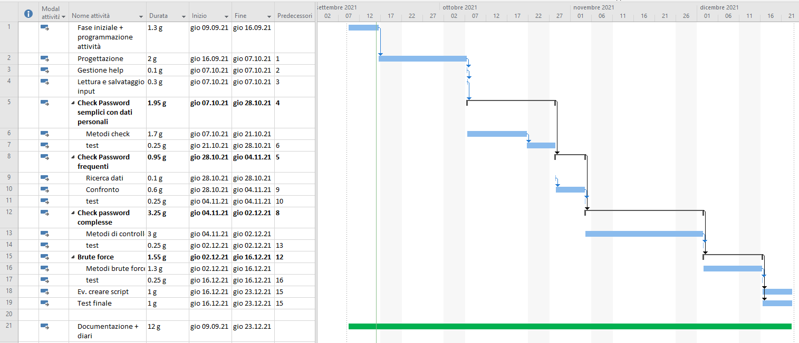

# PasswordSecurityChecker
Si tratta di un applicativo che, passate alcune informazioni base, prova a forzare la password fornita provando tutte le combinazioni dalle più frequenti a quelle meno probabili.

## Gantt preventivo

## Collegamenti
[Documentazione](Documenti/Documentazione_PSC.md)

[Gantt Preventivo](Documenti/PasswordSecurityChecker-consuntivo.mpp)

[Diari](Diari/)