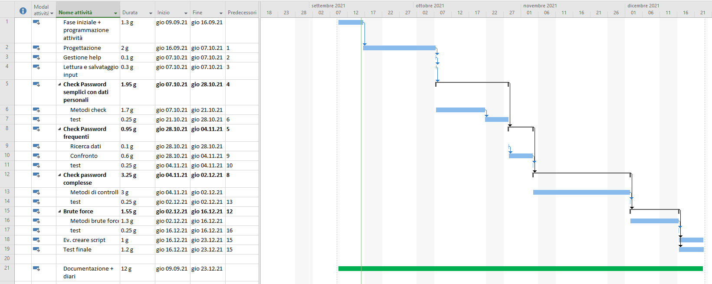

# PasswordSecurityChecker

|Autore      |Docente responsabile|
|------------|--------------------|
|Erik Pelloni|Luca Muggiasca      |

## Descrizione

Si tratta di un applicativo che, passate alcune informazioni base, prova a forzare la password fornita provando tutte le combinazioni dalle più frequenti a quelle meno probabii ed eventualmente con un attacco brute force.

## Informazioni

|Data inizio |Data consegna|
|------------|-------------|
|09.09.2021  |23.12.2021   |

## Gantt preventivo

## Collegamenti
[Documentazione](Documenti/Documentazione/Documentazione_PSC.md)

[Diari](Diari/)

[Gantt](Documenti/Gantt/)

[Mandato (QdC)](Documenti/QdC_EP_PasswordSecurityChecker.docx)

[Manuale d'uso](Documenti\PasswordSecurityChecker_Guida.docx)